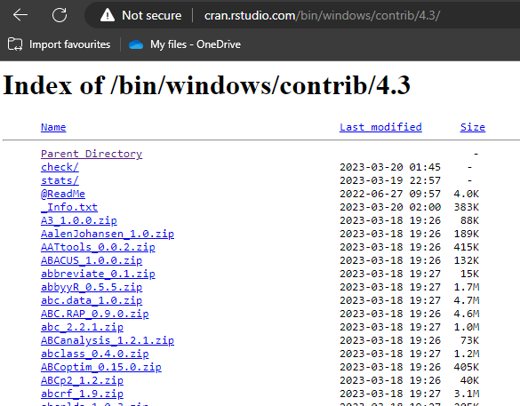
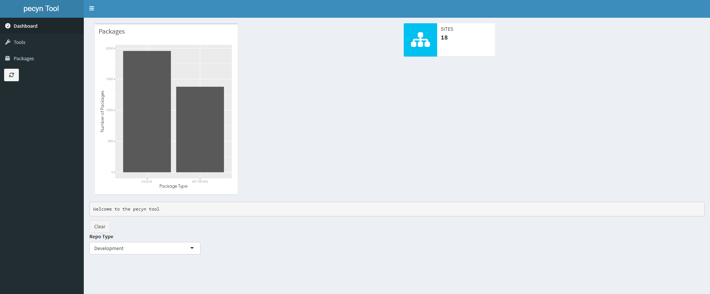
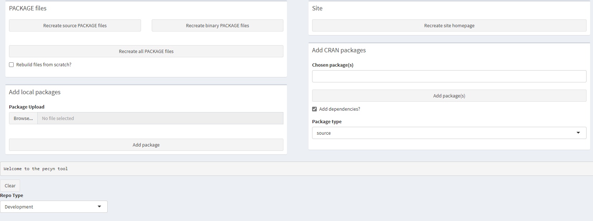
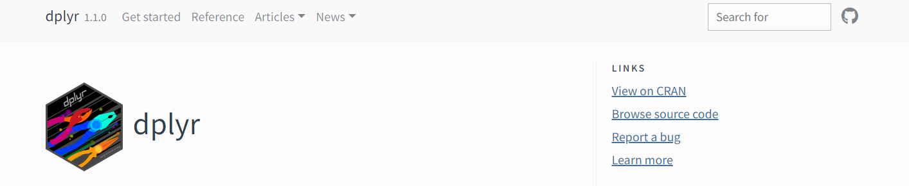
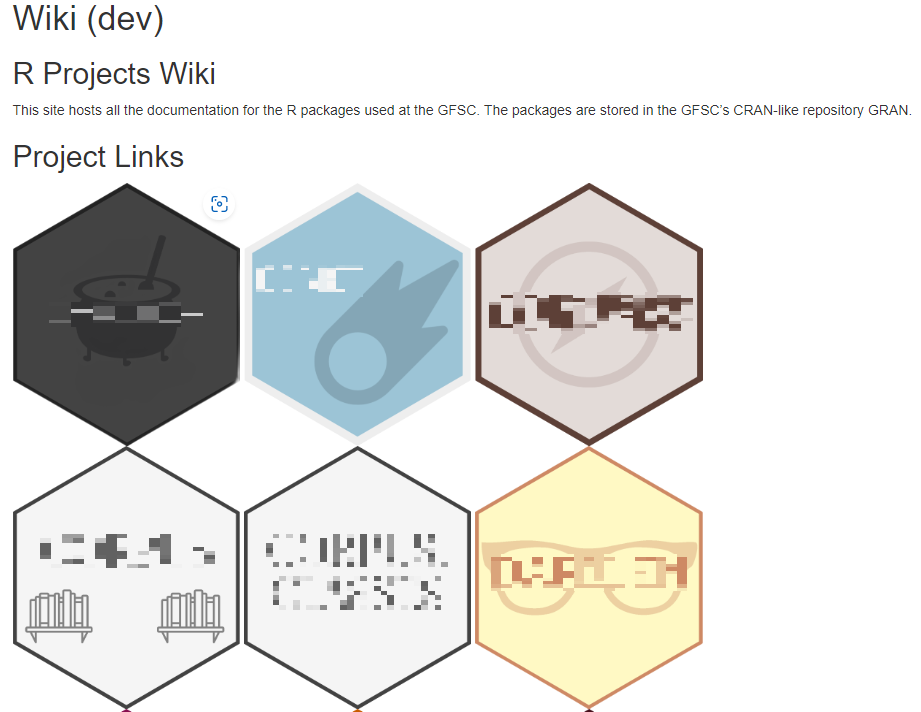
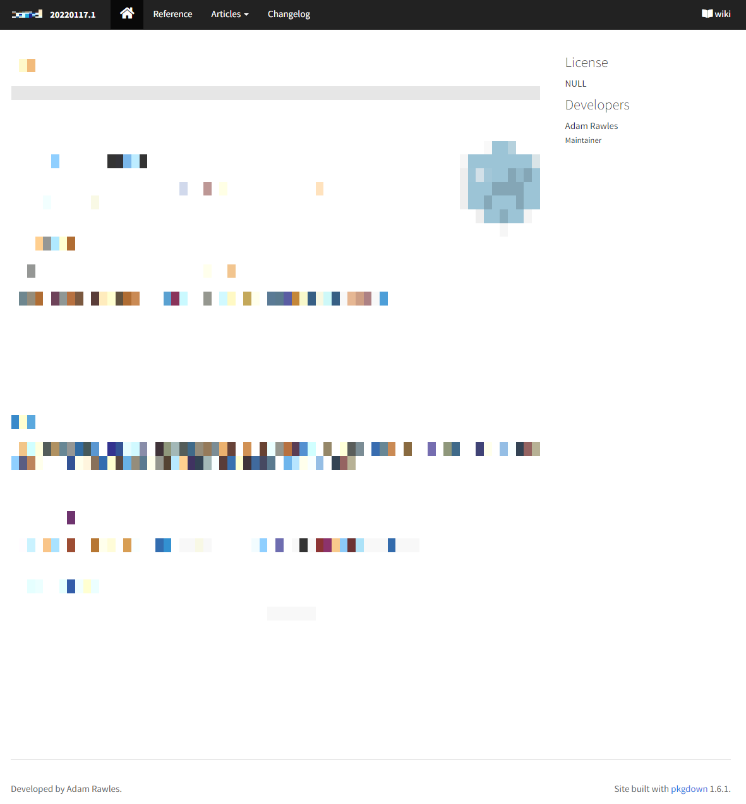

```{r setup, include=FALSE}
options(htmltools.dir.version = FALSE)
library(DiagrammeR)
library(DiagrammeRsvg)
```


# Who am I?

.big-gap[
- Adam Rawles 
    - Senior Data Scientist (GFSC) 
    - Written a R book for beginners called [teacheR](https://teacher.arawles.co.uk) 
    - Worked with R for roughly 6 years
    
]

---

# Overview

- What is an R package?

- Package repositories

- CRAN

- Types of packages

- Repository structure

- Building your own

- Issues and workarounds

---

# What is an R package?

- A bundle of code and/or data designed to provide additional functionality

--

- Allows for a modular and reproducible way of expanding R

--

- 'Base' R actually includes a number of packages (`{stats}`, `{utils}`)

--

- There are thousands of packages available
    + `{dplyr}`
    + `{ggplot2}`
    + `{shiny}`
    + `{data.table}`
    + `{mlr3}`

--

- They are installed via the `install.packages()` command

---

# Package repositories

- Packages are usually stored in central repositories for easier sharing and installation

--

- Package repositories are just web servers with a very specific folder structure

--

- The most popular and widely used public R package repository is CRAN

---

# CRAN

- CRAN stands for *C*omprehensive *R* *A*rchive *N*etwork

--

- It's a huge repository of thousands of user-submitted packages

--

- Users make a submission to CRAN, where volunteers will then evaluate the package and decide whether or not to host it

--

- This is the main repository from which users install packages
    + It's the default repository that `install.packages()` uses
    + Although you can install packages from various sources, particularly with the `{remotes}` package
    

---

# Types of packages

- Before we can understand how CRAN hosts packages, we need to know about the two different types of packages:

--

    + Source packages

    + Binary packages

---

# Source packages

- Source packages are essentially just directories of code

--

- They contain common components like:
    + A 'DESCRIPTION' file that describes the package
    + A 'R' folder that holes the `.R` files
    
--
    
- These source packages are then bundled up into a single `.tar.gz` file so they can be shared easily

--

- All packages will exist in this source form at some point

--

- To install a source package, you'll need to have the development tools (RTools and any other required libraries or compilers) required to 'build' it
   + R will then build it into a binary package and then install it

--

- Source packages are submitted to CRAN, which then builds them and provides both the source and binary version for download

---

# Binary packages

--

- These are like 'built' versions of source packages

--

- The R code from the source package is converted into a more efficient storage format

--

- Any code that required compilation (like C, C++ or Fortran code) will be compiled before being included

--

- Binary packages are platform specific
    + Windows binary packages are stored as `.zip` files 
    + Mac OS binary package are stored as `.tgz` files
    + Linux binary packages are a different story...
    
---

# Binary vs source packages

- Source packages are platform agnostic whereas binary packages are platform-specific

--

- R only installs binary packages, so installing a source package requires you to have the tools to turn it into a binary package first


---

# Package repository structure

- A package repository is just a simple web server with a very specific folder structure...

--

- At the root, we have two folders: `bin` and `src`

---

# Binary

- Then we have different folders for each platform (Windows & Mac)

--

    + `bin/windows`
--

- Then we have different folders for different types of package:
    + `base` - packages that should come with base R
    + `contrib` - packages that have been contributed for R version 3.4 and above
    + `old contrib` - package that have been contributed for R version 3.3 and below
--
    + `bin/windows/contrib`
    
--

- Then we've got folders for the different major versions of R   
    + 4.0, 4.1, etc.
--
    + `bin/windows/contrib/4.3`

--

- Together, our path to the folder that holds all the packages might look like this:
    `https://cran/bin/windows/contrib/4.3/`
    
---

# Source

- For the `src` directory, things are much simpler...

--

- We have no platform or version folder, just the `base`/`contrib` split

--

- So a path to the folder that holds the source packages might look like this:
    `https://cran/src/contrib/`
    
---

# PACKAGES file

- In that final folder, you'll find all the packages and a PACKAGES file

--

- This is an index of all the packages that are available and is constructed from information in their DESCRIPTION files:

.half-size[
```
...
Package: zip
Version: 2.2.2
Suggests: covr, processx, R6, testthat, withr
License: MIT + file LICENSE
MD5sum: f4c02a28bd7cb498e6131775bcb5e67b
NeedsCompilation: yes
URL: https://github.com/r-lib/zip#readme

Package: zoo
Version: 1.8-11
Depends: R (>= 3.1.0), stats
Imports: utils, graphics, grDevices, lattice (>= 0.20-27)
Suggests: AER, coda, chron, ggplot2 (>= 3.0.0), mondate, scales,
        stinepack, strucchange, timeDate, timeSeries, tis, tseries, xts
License: GPL-2 | GPL-3
MD5sum: d683e8ce8b6baa69867c20e8510c00ee
NeedsCompilation: yes
URL: https://zoo.R-Forge.R-project.org/
...
```
]

---

```{r, echo=FALSE}
DiagrammeR::grViz("
digraph structure {
  # a 'graph' statement
  graph [overlap = true]
  # several 'node' statements
  node [shape = box,
        fontname = Helvetica,
        width = 0.6,
        fontsize = 7,
        style = filled,
        fillcolor = Grey]
  'https://cran.rstudio.org/';
  
    node [shape = box,
        fontname = Helvetica,
         width = 0.6,
        fontsize = 7,
        style = filled,
        fillcolor = Grey]
  'bin/';
  node [shape = box,
        fixedsize = true,
        width = 0.6,
        fontsize = 7,
        style = filled,
        fillcolor = Grey] // sets as circles
   '{platform}/';
  
    node [shape = box,
        fontname = Helvetica,
        width = 0.6,
        fontsize = 7,
        style = filled,
        fillcolor = Grey]
  '{type}/';
  
      node [shape = box,
        fontname = Helvetica,
        width = 0.6,
        fontsize = 7,
        style = filled,
        fillcolor = Grey]
  '{version}/';
  
        node [shape = box,
        fontname = Helvetica,
        width = 0.6,
        fontsize = 7,
        style = filled,
        fillcolor = Grey]
  'src/';
  
  
          node [shape = box,
        fontname = Helvetica,
        width = 0.6,
        fontsize = 7,
        style = filled,
        fillcolor = Grey]
  PACKAGES;
  
  'https://cran.rstudio.org/'->'src/'
  'https://cran.rstudio.org/'->'bin/'
  'src/'->'{type}/'
  'bin/'->'{platform}/'
  '{platform}/'->'{type}/'
  '{type}/'->'{version}/'
  '{version}/'->PACKAGES
  '{type}/'->PACKAGES
  
}")
```
---



---

# Installing packages from a repository

- Let's have a look at the `install.packages()` function...

--

```
install.packages(pkgs, lib, repos = getOption("repos"),
                 contriburl = contrib.url(repos, type),
                 type = getOption("pkgType"),
                 ...)
```
--

- We've got three important parameters here:
    + `repos` - this is the URL or path to our repository (default is CRAN)
    + `contriburl` - this is the path to the folder that contains the packages
        + This is contructed automatically from the repository path and the type of package
    + `type` - this is the type of package we want to install (binary/source)

---

# Installing packages from a repository

- When we run `install.packages()`, R will download the PACKAGES file from the `contrib` folder we've specified

--

- Then it will search for the packages we've specified (via the `pkgs` parameter)

--

- If it finds them, it will try and install them

---

# Problems with using CRAN in a business environment

- CRAN is a fantastic repository for public use, but it's not always perfect for use in a business...

--
    1. If you want CRAN to host your packages, you'll have to abide by their relatively strict rules around package quality and support

    2. Packages you submit are public

    3. If you allow your users direct access to CRAN, they can install any package

--

- So what if we created our own package repository?

---

# Building your own repository

- We need:
.pad-line[
    + A web server hosting a simple file structure that matches what we've just seen
]
--
.pad-line[
    + A way of receiving packages
]
--
.pad-line[
    + A way of building binary packages
]
--
.pad-line[
    + A way of creating/updating the PACKAGES file
]
--
.pad-line[
    + (optional) A way of managing the repository
]
--
.pad-line[
    + A funny name
]
    
---

# Introducing...

.gran-title[
GRAN
]
    
---

# Web server

- We used nginx and network-attached storage so that we could host GRAN in multiple separate environments

--

- This was deployed as a Docker container with the underlying file-share exposed as a volume

--

- We could access the server via `https://gran`

    + So the path to our src packages is `https://gran/src/contrib/`


---

# Receiving and building packages

- We built a custom R package called `{pecyn}` to accept packages and manage the GRAN repository

--

- `{pecyn}` has 3 functions:
    + It receives packages over HTTP via an exposed API
    + It builds source packages to binary packages (storing both forms)
    + It also included a Shiny app to help monitor the repository and perform maintenance
    
--

- The `{pecyn}` API was created using [`{plumber}`](https://www.rplumber.io/) and was available at `https://pecyn`
    + You make a POST request to `https://pecyn/binary` or `https://pecyn/source` depending on the type of package you're sending with the package in the body of the request

--

- `{pecyn}` is installed onto a Docker image and deployed
    + In reality, two containers were deployed from the same `{pecyn}` image
        + One for the API (The CMD is `pecyn::run_api()`)
        + One for the Shiny app (The CMD is `pecyn::run_app()`)

    
---

# Receiving and building packages

- `{pecyn}` builds the package if it needs to, and places the package in the correct folder (e.g. `/src/contrib/`)

--

- And finally, `{pecyn}` recreates the PACKAGES file

    + The base `{tools}` package provides the `update_PACKAGES()` and `write_PACKAGES()` functions to help with that
    
---

```{r, echo=FALSE}
DiagrammeR::grViz("
digraph process {
  # a 'graph' statement
  graph [overlap = true]
  # several 'node' statements
  node [shape = box,
        fontname = Helvetica,
        width = 0.6,
        fontsize = 7,
        style = filled,
        fillcolor = Grey]
  Package;
  
    node [shape = box,
        fontname = Helvetica,
         width = 0.6,
        fontsize = 7,
        style = filled,
        fillcolor = Grey]
  'pecyn API';
  node [shape = box,
        fixedsize = true,
        width = 1,
        fontsize = 7,
        style = filled,
        fillcolor = Grey] // sets as circles
   'Build binary package';
  
    node [shape = box,
        fontname = Helvetica,
        width = 0.6,
        fontsize = 7,
        style = filled,
        fillcolor = Grey]
  '/src/contrib/';
  
      node [shape = box,
        fontname = Helvetica,
        width = 1,
        fontsize = 7,
        style = filled,
        fillcolor = Grey]
  '/bin/.../contrib/.../';
  
        node [shape = box,
        fontname = Helvetica,
        width = 1.2,
        fontsize = 7,
        style = filled,
        fillcolor = Grey]
  'Recreate PACKAGES file';
  
  Package->'pecyn API'
  'pecyn API'->'/src/contrib/'
  'pecyn API'->'Build binary package'
  'Build binary package'->'/bin/.../contrib/.../'
  '/bin/.../contrib/.../'->'Recreate PACKAGES file'
  '/src/contrib/'->'Recreate PACKAGES file'
  
}")
```
---

# Managing the repository

- `{pecyn}` also includes a Shiny-based UI that helps with maintaining the repository



---

# Managing the repository

- The `{pecyn}` UI lets you do things like update your PACKAGE files, or update/add packages from CRAN




---

.gran-title[
Done!
]

---

# How can we improve on CRAN?

--

1. Authentication
    + We only want certain people in the company accessing the repository

2. When you install a package with `install.packages()`, R will always install the latest version
    + There's no option to install a previous version
  
3. Similarly, we can't differentiate between development/stable/feature versions of a package

4. There is no support to include modern documentation sites generated by `{pkgdown}`



---
.gran-title[
Let's see if we can fix these...
]

---

# Authentication

--

- The `install.packages()` function can download packages using a few different methods (`curl`, `libcurl`, `wget`)

    + The default is 'auto' which chooses the most appropriate method for your OS

--

- For some of these download methods, we can provide command line arguments

--

- If we look at the documentation, we can see that `install.packages()` uses the `download.file.method` and `download.file.extra` options to decide which method and which command-line arguments to use

    + Or we can provide the same arguments via the `method` and `extra` parameters

--

- So, by setting those parameters to use `curl` as the download method and using the `--negotiate` command line argument, we can utilise single-sign on to access GRAN!

    + `install.packages("https://gran", method="curl", extra="--negotiate")`

    + P.S. You also need to configure your web server to allow for the negotiate authentication method

--

- Alternatively, you can use basic authentication with a username and password:

    + `install.packages("https://gran", method="curl", extra="-u arawles:mypassword")`


---

# Versioning & Branches

--

- When we recreate our PACKAGES file (with `update_PACKAGES`), we can keep a note of all of the versions that are available by changing `latestOnly` to `FALSE`

--

- We can also include additional fields from the DESCRIPTION files in the packages that aren't usually included in the PACKAGES file
    + Here's where we can include a `branch` value (like `main`/`dev`/`feature-x`)
    
---

# Our PACKAGES file

.half-size[
```
...
Package: {package-name}
Version: 20210426.1
Depends: R (>= 3.5.0)
Imports: shiny, shinydashboard, shiny.semantic, shiny.router,
        DT, waiter, reactable, dplyr, lubridate, dashboardthemes,
        readr, purrr, stringr, R6, ggplot2
MD5sum: beb09ba710d761915d3ac3221dac7850
NeedsCompilation: no
Branch: dev

Package: {package-name}
Version: 20210426.2
Depends: R (>= 3.5.0)
Imports: shiny, shinydashboard, shiny.semantic, shiny.router,
        DT, waiter, reactable, dplyr, lubridate, dashboardthemes,
        readr, purrr, stringr, R6, ggplot2
MD5sum: 233350246644a4765f2c9e4e9881807a
NeedsCompilation: no
Branch: dev
...
Package: XML
Version: 3.99-0.13
Depends: R (>= 4.0.0), methods, utils
Suggests: bitops, RCurl
License: BSD_3_clause + file LICENSE
MD5sum: 463cf7ee81bcfa39de6ecec31a5cacab
NeedsCompilation: yes
URL: https://www.omegahat.net/RSXML/
...
```
]

---

# Versioning & Branches

- But the `install.packages()` function doesn't have any way to use the version information...

--

- So, let's write our own `install.packages()` equivalent!

---

# `install_gran()`

.half-size[
```
install_gran(
  pkgs,
  version = NULL,
  branch = NULL,
  deps = c("all", "imports", "suggests", "none"),
  type = c("default", "win.binary", "source"),
  method = "curl",
  extra = c("--negotiate"),
  repos = c(`GRAN`="https://gran/"),
  ignore_repo_cache = TRUE,
  Ncpus = 8,
  ...
)
```
]

---

# `install_gran()`

.big-gap[
- Here's how our new and improved installer works:
  1. Have `pkgs`, `versions` & `branch` parameters
  2. If `versions` is NULL, then take the latest 
  3. If `branch` is NULL, then ignore the branch
  4. Download the PACKAGES file for our repository
  5. Find the packages we want
  6. Find the matching version & branch
]

--

- This allows us install any version of our packages from any branch we like!

---

# Automatic documentation

--

- The `{pkgdown}` package automatically creates a website with all of your documentation for your package

--

- It would be great if we could detect packages that include a website generated by `{pkgdown}` and automatically host it on GRAN

--

- That's exactly what `{pecyn}` does!

    + When making our HTTP request, we can specify a `docs_folder` which contains our website
    
        * This will usually be generated automatically by `{pkgdown}` but it doesn't have to be
        
    + `{pecyn}` will then copy that website to a `/docs` folder at the base of the repository
    
    + `{pecyn}` also recreates the index page at `https://gran/docs/` to include a link to the new package

--

- This gives us a nice wiki for all of our supported packages!

---



---



---

# Other cool features

- This was integrated with the continuous integration tools we use

- So whenever we committed new changes to any of the packages, the CI tool would rebuild the package and send the new version to GRAN

--

- Because `{pecyn}` is an R package, it's also available on GRAN!

    + So when there's a new version, we can upload the new version of `{pecyn}` to GRAN, via `{pecyn}` and then redeploy `{pecyn}` with the new version
  
--

- Thanks to a PR for the `{downlit}` package that deals with automatic linking between packages, your `{pkgdown}` documentation pages can link to each other!

    + You just need to make sure you have the right URL value in your DESCRIPTION file of your packages (e.g., `https://gran/dev/docs/{my-package}`)

---

# Issues

--

- Keeping up-to-date with CRAN

    + Packages will often get updates on CRAN and we want to keep our repository up-to-date
    
    + This currently requires administration directly from the `{pecyn}` Shiny app using the `{miniCRAN}` package

--

- Bootstrapping

    + Because `{pecyn}` is installed from GRAN when we update it, what happens if GRAN goes down?
    
    + This means we have to maintain an alternative 'cold start' release for new versions of `{pecyn}`

--

- Content moderation

    + What happens if you have hundreds of data scientists storing hundreds of packages?
    
    + How do you enforce quality checks or a deprecation pattern of old versions?
    
--

- Security

    + There are no checks on the content of what's uploaded
    
---

# Posit Package Manager


- If you want all the above and more, then check out [Posit (previously RStudio) Package Manager](https://packagemanager.rstudio.com/client/#/)

--

- It also provides support for Python packages!

--


But you have to pay for it...

